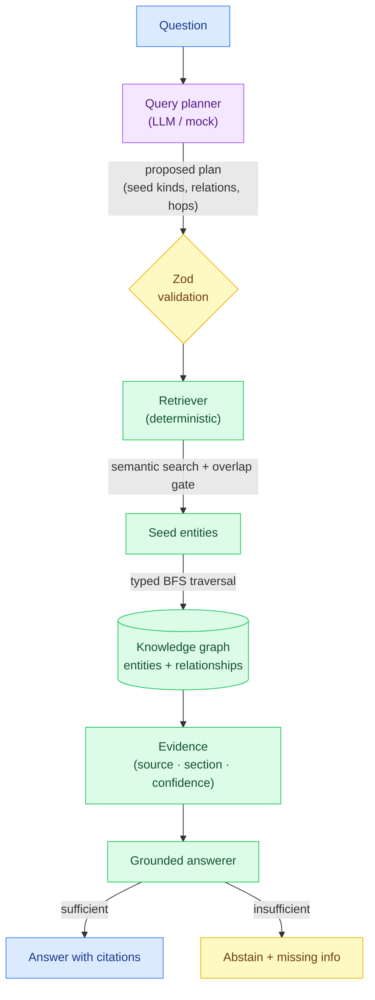
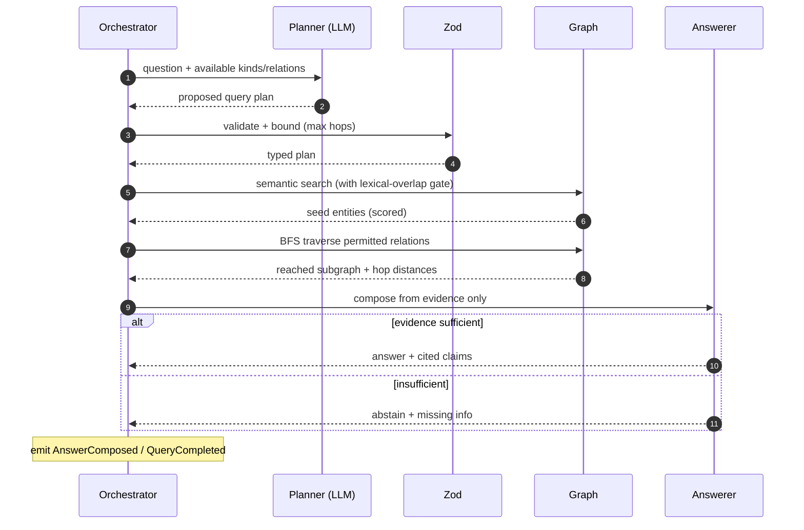

# Knowledge Workspace

**▶ Live demo: https://parag-labs.github.io/knowledge-workspace/** — runs entirely in your
browser (the engine is pure, deterministic TypeScript, so the whole demo is client-side; no
backend, no API key).

A visual, **evidence-grounded knowledge graph workspace**. Ask a question in plain English —
*"Why did we choose Cosmos DB?"* — and instead of answering from a blob of retrieved text, it
**traverses a graph** of people, decisions, documents, meetings and requirements, then returns
an answer where **every claim carries a citation** (source, section, confidence). If the graph
doesn't support an answer, it says so rather than guessing.

> The LLM plans the query. Deterministic code traverses the graph, retrieves evidence, and
> grounds every claim in a cited source.

---

## Problem

Traditional RAG is *question → vector search → chunks → answer*. It loses the relationships
that actually explain a decision, and it will happily hallucinate when the chunks are thin.

This project keeps the relationships:

```
question → graph traversal → documents → decisions → meetings → people → evidence → answer
```

The model's job is narrow and safe: **propose a query plan** (which entity kinds to seed on,
which relationships to traverse, how deep). It never touches the graph or writes the answer.
Deterministic code executes the plan, and the answer is assembled **only** from retrieved
evidence — so an uncited claim is impossible by construction, and an off-topic question gets
an honest "I don't have grounded evidence for that."

## Demo

```bash
pnpm install
pnpm dev          # http://localhost:3000
```

Ask one of the sample questions (or your own). The graph highlights the seed entities and the
subgraph the traversal reached; the panel shows the grounded answer, the evidence with
confidence scores, and the full query trace. Try *"What is our policy on pineapple pizza?"* to
watch it correctly **abstain**.

Reproduce the evaluation numbers at any time:

```bash
pnpm eval
```

## Screenshots

Left: the knowledge graph, with seed nodes ringed green and the reached subgraph highlighted
(unreached nodes dimmed). Right: the grounded answer, an evidence list with per-item
confidence, and the step-by-step query trace. Run `pnpm dev` to see it live.

## Architecture



Only the planner runs a model. Search, traversal, evidence scoring and answer composition are
all deterministic and unit-tested.

## Agent workflow



## Example

Question: **"Why did we choose Cosmos DB?"**

The engine seeds on the *Adopt Azure Cosmos DB* decision, traverses `SUPPORTED_BY`,
`REQUIRES`, `DISCUSSED_IN` and `ABOUT`, and returns an answer citing the design doc, the
benchmark, and the latency requirement — each with a confidence score:

```
- Document: The design compares Cosmos DB, PostgreSQL and DynamoDB … [Atlas Datastore Design § Options considered · confidence 0.65]
- Document: Benchmarks show p99 read latency of 8ms across three regions … [Datastore Benchmark § Results · confidence 0.65]
- Requirement: Reads must complete under 10ms at p99 in every served region. [Atlas PRD § NFR-3 · confidence 0.65]
```

## TypeScript design

- **Branded IDs** (`EntityId`, `EvidenceId`, `QueryId`) keep id kinds from being mixed up.
- **A discriminated-union entity model** (`Person` / `Project` / `Document` / `Decision` /
  `Meeting` / `Task` / `Requirement` / `Technology`) and a **relationship-type union**
  (`MADE`, `SUPPORTED_BY`, `DISCUSSED_IN`, …) — invalid kinds or relations are compile errors.
- **A typed event union** (`QueryEvent`) with an exhaustive replay reducer.
- **Zod at the trust boundary**: the planner's plan and all ingested graph input are validated
  before the deterministic core touches them.
- **A pluggable `Embedder`**: the default is a deterministic hashing embedder (reproducible,
  no API key); a real model drops in behind the same interface.

## Evidence grounding & the MCP surface

Every claim exposes **source · section · confidence**. Confidence is deterministic: seed
similarity for directly-matched entities, decayed by hop distance for entities reached through
the graph. The spec's MCP tools are implemented as typed, Zod-validated functions over the
graph (`src/engine/mcp.ts`): `knowledge.search`, `knowledge.related`, `knowledge.get_entity`,
`knowledge.get_evidence` — the same surface an MCP server would expose to an external agent.

## Security

See [SECURITY.md](SECURITY.md). The essentials:

- **The model cannot fabricate.** It only proposes a plan; the answer is composed solely from
  retrieved evidence, so a claim without a citation cannot occur.
- **Honest abstention.** A question with no semantically-close, citable evidence returns
  "insufficient evidence" plus what's missing — not a guess.
- **Bounded traversal.** Depth is capped by the engine regardless of what the model requests.
- **Validated boundaries.** Planner output and ingested graph data are Zod-checked.

## Evaluation

Produced by `pnpm eval` from real runs — never hand-written. The groundedness metric is
**unsupported** (claims with no citation): always 0.

| Scenario       | Status                | Seeds | Evidence | Claims | Unsupported | Sources | Tokens |
|----------------|-----------------------|-------|----------|--------|-------------|---------|--------|
| why cosmos     | answered              | 5     | 5        | 5      | 0           | 5       | 24     |
| who decided    | answered              | 5     | 5        | 5      | 0           | 4       | 26     |
| unknown topic  | insufficient_evidence | 0     | 0        | 0      | 0           | 0       | 25     |

The "unknown topic" row is the important one: an off-topic question yields **no claims and no
citations** — the engine abstains instead of inventing an answer.

## Local setup

Requirements: Node 20+, pnpm 9+. No API keys, no database required.

```bash
pnpm install
pnpm dev
pnpm test         # unit tests (Postgres integration test auto-skips)
pnpm typecheck
pnpm lint
pnpm eval
pnpm build
```

The persistence layer is a Drizzle/Postgres `Store` for self-hosting, exercised by the CI
integration test; the demo runs client-side with an in-memory graph. To try Postgres, set
`DATABASE_URL` (see `.env.example`) and run `pnpm db:migrate`.

## Docker

```bash
docker compose up --build   # http://localhost:3000
```

Builds and serves the app (client-side). No secrets required.

## Testing

- **Unit** — graph search/traversal/subgraph, the embedder, evidence grounding, the MCP tools.
- **Agent / failure-path** — invalid plans fail safely, traversal depth is bounded, off-topic
  questions abstain.
- **Grounding** — every evidence item exposes source/section/confidence; every claim is backed.
- **Integration** — a Postgres round-trip that persists and rehydrates a queryable graph,
  running in CI and auto-skipping locally when `DATABASE_URL` is unset.
- **Evaluation** — repeatable scored scenarios asserting 0 unsupported claims.

```bash
pnpm test
```

CI runs on the deterministic embedder and mock planner — no API keys.

## Roadmap

- Document ingestion that extracts entities and relationships into the graph automatically.
- A real embedding model behind the `Embedder` interface (and pgvector for search at scale).
- Contradiction detection and freshness scoring across evidence.
- A temporal graph: how decisions and their support evolved over time.
- Multi-agent research that expands the graph to answer follow-up questions.

## Layout

```
knowledge-workspace/
├── src/
│   ├── engine/                 # deterministic core (framework-free, unit-tested)
│   │   ├── ids.ts              # branded id types
│   │   ├── entities.ts         # entity discriminated union + relationship types + Zod
│   │   ├── embedding.ts        # deterministic hashing embedder + cosine
│   │   ├── graph.ts            # knowledge graph: search, neighbours, BFS traversal, subgraph
│   │   ├── llm.ts              # query planner abstraction (MockQueryPlanner / Scripted)
│   │   ├── events.ts           # typed event union + append-only EventLog
│   │   ├── answer.ts           # retrieve + grounded compose (evidence, citations, confidence)
│   │   ├── orchestrator.ts     # ask(): plan → validate → retrieve → ground (event-sourced)
│   │   ├── mcp.ts              # MCP tool surface: search / related / get_entity / get_evidence
│   │   ├── replay.ts           # fold events into a query view
│   │   ├── evaluate.ts         # scored scenarios (0 unsupported claims)
│   │   ├── examples.ts         # seed graph (the Cosmos DB worked example)
│   │   ├── eval-cli.ts         # `pnpm eval`
│   │   └── __tests__/          # unit / grounding / MCP / evaluation tests
│   ├── db/                     # Drizzle/Postgres Store (self-host + integration-tested)
│   ├── app/                    # Next.js app router (client-side workspace)
│   └── components/Workspace.tsx # React Flow graph + answer/evidence/trace panels
├── ARCHITECTURE.md
├── SECURITY.md
├── CONTRIBUTING.md
├── CHANGELOG.md
├── Dockerfile
└── docker-compose.yml
```

## License

MIT — see [LICENSE](LICENSE).
